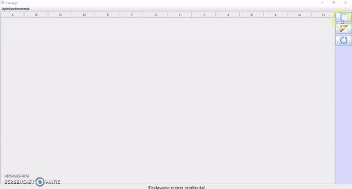

# UniGrades
## Demo: 

  
A simple app for managing university classes, activities and grades

Users can:
-add new classes and activities within the class
-keep track of their grades and achieved points
-change style (font,color)
-choose a preset of an university semester

Admin, uppon loging in can change the grade system and a few other settings

App preview can be seen in the "Screenshots" folder in the Project

Language: Serbian
